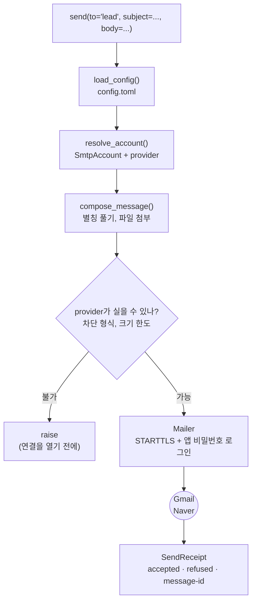

# mailmail

[English](README.md) | **한국어**

NAVER·Gmail 계정으로 메일을 보내는 파이썬 패키지. 첨부파일, HTML 본문, 참조를 지원하고,
자주 보내는 사람은 이름으로 저장해두고 부를 수 있다.

---

- [빠른 시작](#빠른-시작)
- [구조 한눈에](#구조-한눈에)
- [준비물](#준비물)
- [1. 설치](#1-설치)
- [2. 계정 설정](#2-계정-설정) (`~/.config/mailmail/config.toml`)
- [3. 앱 비밀번호 받기](#3-앱-비밀번호-받기) — NAVER, Gmail
- [4. 메일 보내기](#4-메일-보내기)
- [여러 통 한 번에 (메일 머지)](#여러-통-한-번에-메일-머지) (`send_bulk`)
- [명령줄에서 쓰기](#명령줄에서-쓰기) (`mailmail`)
- [못 보내는 파일](#못-보내는-파일)
- [Claude Code에서 쓰기](#claude-code에서-쓰기)
- [문제가 생기면](#문제가-생기면)
- [개발](#개발)

## 빠른 시작

```python
from mailmail import send

send(
    to          = "someone@example.com",
    subject     = "주간 보고",
    body        = "첨부 확인 부탁드립니다.",
    attachments = ["report.xlsx"],
)
```

Claude Code를 쓴다면 파이썬을 몰라도 말로 보낼 수 있다 → [Claude Code에서 쓰기](#claude-code에서-쓰기)

Windows·macOS·Linux에서 동작한다. 설치되는 것은 이 패키지뿐이고, 다른 라이브러리를 함께
끌어오지 않는다.

## 구조 한눈에

`send()` 한 번은 설정을 읽고, 계정을 고르고, 별칭을 풀어 메시지를 만들고, provider가
반송할 것 — 차단된 파일 형식, 크기 한도를 넘는 메일 — 은 연결을 열기 전에 막고, 결과를
`SendReceipt`로 돌려준다.



## 준비물

- **Python 3.11 이상.** 터미널에서 `python --version`으로 확인한다. (Windows에서는 `py
  --version`일 수 있다.) 없거나 낮으면 [python.org](https://www.python.org/downloads/)에서
  받는다.
- **NAVER나 Gmail 계정.** Gmail은 누구나 만들 수 있다. NAVER는 한국 휴대폰 번호가 있으면
  가장 쉽다 — 외국인은 외국인등록증(ARC)으로 번호를 개통한다. 한국 번호가 없으면 여권·정부
  발급 신분증 인증으로도 가입할 수 있고, 이 경우 하루이틀 걸린다. 요건은 자주 바뀌고 국가마다
  다르니 NAVER 가입 페이지에서 확인한다. NAVER 계정이 없으면 Gmail로 하면 된다.
- **그 계정의 앱 비밀번호.** 3단계에서 받는다. **평소 로그인하는 비밀번호로는 안 된다** —
  두 서비스 다 거부한다.

## 1. 설치

```sh
pip install mailmail
```

잘 됐는지 확인:

```sh
python -c "import mailmail; print(mailmail.__version__)"
```

## 2. 계정 설정

홈 폴더 아래 `.config/mailmail/` 에 `config.toml` 파일을 만든다. 전체 경로는 이렇다.

| | 경로 |
|---|---|
| macOS · Linux | `~/.config/mailmail/config.toml` |
| Windows | `C:\Users\<사용자이름>\.config\mailmail\config.toml` |

폴더가 없으면 만든다. 파일 내용은 자기 주소로 바꿔서:

```toml
default_account = "naver"

[accounts.naver]
provider = "naver"
username = "you@naver.com"

[accounts.gmail]
provider = "gmail"
username = "you@gmail.com"

[contacts]
me   = "you@naver.com"
lead = "lead@example.com"
team = ["me", "lead"]
```

- `default_account` — 계정을 안 고르면 어느 걸로 보낼지.
- `[accounts.*]` — 쓸 계정들. 하나만 있어도 된다. `provider`는 `naver` 또는 `gmail`.
- `[contacts]` — 주소록. 안 써도 된다. 여러 명을 묶으면(`team`) 한 번에 보낼 수 있고,
  묶음 안에 다른 이름을 넣어도 된다.

**비밀번호는 이 파일에 넣지 않는다.** 3단계에서 따로 저장한다.

## 3. 앱 비밀번호 받기

**여기가 가장 많이 막히는 곳이다.** 평소 로그인 비밀번호는 두 서비스 다 거부하고, 앱
비밀번호를 따로 발급받아야 한다. 둘의 형식이 정반대라 헷갈리기 쉽다.

| | 자릿수 | 형태 | 2단계 인증 |
|---|---|---|---|
| **NAVER** | **12자리** | **대문자 + 숫자** | 필수 |
| **Gmail** | **16자리** | **소문자** | 필수 |

### NAVER

2025년 6월 24일부터 메일 프로그램 연결에 2단계 인증과 앱 비밀번호가 **필수**가 되었다. 예전에
잘 되던 설정이 갑자기 안 된다면 그 때문이다.

1. **네이버ID → 보안설정 → 2단계 인증**을 켠다. 이걸 안 켜면 다음 단계 메뉴가 아예 없다.
2. 같은 화면에서 **애플리케이션 비밀번호 → 생성하기**.
   - **종류선택은 그냥 이름표다.** 아웃룩·아이폰·지메일 중 뭘 고르든 나오는 비밀번호는 같다.
     직접 입력에 mailmail이라고 적어두면 나중에 알아보기 좋다.
   - 12자리 대문자+숫자가 나온다. **그 화면을 벗어나면 다시 못 본다.** 복사해둔다.
3. **메일 → 환경설정 → POP3/IMAP 설정**에서 **SMTP 사용함**을 확인한다. 이미 켜져 있어도
   **사용 안 함 → 저장 → 사용함 → 저장** 으로 한 번 껐다 켠다. 2025년 6월 정책 변경이 이때
   반영된다.

### Gmail

1. **2단계 인증을 먼저 켠다.** 안 켜면 앱 비밀번호 메뉴가 나타나지 않는다.
2. [myaccount.google.com/apppasswords](https://myaccount.google.com/apppasswords) 에서
   발급한다.
3. 16자리 소문자가 네 칸씩 띄어서 나온다. 공백은 있든 없든 상관없다.

### 받은 비밀번호 저장하기

**한 번만 저장하면 그 뒤로는 다시 묻지 않는다.** 아래를 실행하면 입력을 받는다.

```sh
python -c "
from getpass import getpass
from mailmail import load_config, store_password

account = load_config().resolve_account('naver')                  # Gmail이면 'gmail'
password = getpass(f'{account.username} app password: ').strip()
print(f'  length: {len(password)}')                               # NAVER 12자리, Gmail 16자리
store_password(account, password)
print('  saved')
"
```

붙여넣을 때 **화면에 아무것도 안 보이는 게 정상이다.** 그래서 두 번 붙여넣어도 알 수가
없으니, 위가 찍어주는 자릿수로 확인한다.

비밀번호는 설정 파일이 아니라 같은 폴더의 `credentials.json`에 **본인만 읽을 수 있게**
저장된다. 이 파일은 암호화되지 않는다. 그래서 여기 들어가는 것은 **앱 비밀번호뿐이다** —
메일 발송에만 쓰이고, 계정 비밀번호는 그대로 둔 채 언제든 취소할 수 있다. 계정 비밀번호는
넣지 않는다.

### 잘 됐는지 확인

메일을 보내보지 않고도 로그인만 시험할 수 있다.

```sh
python -c "
import smtplib
from mailmail import load_config, resolve_password

for name in ('naver',):  # Gmail도 저장했으면 ('naver', 'gmail')
    account = load_config().resolve_account(name)
    smtp = smtplib.SMTP(account.provider.smtp_host, account.provider.smtp_port, timeout=20)
    smtp.ehlo(); smtp.starttls(); smtp.ehlo()
    try:
        smtp.login(account.username, resolve_password(account))
        print(f'  {name}: OK')
    except smtplib.SMTPAuthenticationError as e:
        print(f'  {name}: {e.smtp_code} {e.smtp_error.decode()[:60]}')
    smtp.quit()
"
```

`OK`가 나오면 끝났다. 안 나오면:

| 서버가 하는 말 | 뜻 |
|---|---|
| `535 5.7.1 Username and Password not accepted` (NAVER) | 비밀번호가 틀렸거나, SMTP가 꺼져 있다. **둘 다 확인한다** — 이 메시지는 구분해주지 않는다 |
| `534 5.7.9 Application-specific password required` (Gmail) | 로그인 비밀번호를 넣었다. 앱 비밀번호로 다시 |

## 4. 메일 보내기

```python
from mailmail import send

send(
    to      = "someone@example.com",
    subject = "주간 보고",
    body    = "첨부 확인 부탁드립니다.",
)
```

주소록에 등록했으면 이름으로 부를 수 있다. 주소와 섞어도 된다.

```python
send(to="lead", subject="주간 보고", body="확인 부탁드립니다.")
send(to=["lead", "someone@example.com"], subject="주간 보고", body="...")
send(to="team", subject="주간 보고", body="...")  # 묶음은 펼쳐진다
```

본문은 적은 그대로 나가므로 줄바꿈이 그대로 산다. 긴 본문은 따옴표 세 개가 편하다.

```python
body = """\
안녕하세요,

주간 보고 첨부합니다. 손해율이 전월 대비 1.2%p 움직였고,
자세한 건 둘째 시트에 있습니다.

감사합니다.
"""

send(to="lead", subject="주간 보고", body=body, attachments=["report.xlsx"])
```

계정 지정, 첨부, 참조, HTML까지 쓰면:

```python
receipt = send(
    account     = "gmail",  # 안 적으면 default_account
    to          = "lead",
    cc          = "team",
    bcc         = "audit@example.com",
    subject     = "월 마감",
    body        = "월 마감 수치 보냅니다.",
    html        = "<p>월 마감 수치 보냅니다.</p>",
    attachments = ["close.xlsx", "notes.pdf"],
)

if not receipt.is_complete:  # 일부 주소가 거부됐을 때
    print(receipt.reason_by_refused_recipient)
```

몇 가지 알아둘 것:

- **`cc`를 안 적으면 참조는 비어 있다.** 적지 않은 것은 안 들어간다.
- **`bcc`는 받는 사람들에게 안 보인다.** 숨은 참조끼리도 서로 모른다.
- **`html`과 `body`는 같은 내용이어야 한다.** 메일 앱에 따라 둘 중 하나만 보이므로, 다르게
  쓰면 사람마다 다른 메일을 읽게 된다.
- **한글은 그냥 쓰면 된다.** 제목이든 본문이든 따로 처리할 게 없다.

## 여러 통 한 번에 (메일 머지)

같은 안내를 사람마다 다른 값·다른 첨부로 보낼 때는 `send_bulk`을 쓴다. 한 명에 `Mail`
하나씩 담으면, 전부 **연결 하나로** 나간다 — 서른 명이면 로그인이 서른 번이 아니라 한
번이다.

```python
from mailmail import Mail, send_bulk

receipts = send_bulk([
    Mail(to="cheolsu@example.com", subject="6월 실적",
         body="철수님, 첨부 확인 부탁드립니다.", attachments=["cheolsu.xlsx"]),
    Mail(to="younghee@example.com", subject="6월 실적",
         body="영희님, 첨부 확인 부탁드립니다.", attachments=["younghee.xlsx"]),
])

for receipt in receipts:
    if not receipt.is_complete:  # 이 통에서 거부된 주소가 있으면
        print(receipt.reason_by_refused_recipient)
```

`Mail`은 `send`과 같은 어휘다 — `to`·`cc`·`bcc`에 주소나 주소록 이름을 섞어 쓰고,
`attachments`는 경로다. 개인화(이름·수치·첨부)는 통마다 `Mail`을 다르게 만들면 된다.

몇 가지 알아둘 것:

- **결과는 통 순서 그대로 목록으로 온다.** `zip(mails, receipts)`로 누가 어떻게 됐는지
  짝지을 수 있다. 한 통이 수신자 전원 거부돼도 그 통은 `accepted`가 빈 receipt로 남고
  **나머지는 그대로 나간다** — 30통 중 3통이 막히면 27통은 간다.
- **대부분의 나쁜 행은 아무것도 보내기 전에 막는다.** 어느 통에 주소록에 없는 이름, 빈
  제목, 차단된 첨부, 또는 이미 한도를 넘는 첨부가 있으면 **연결을 열기 전에** 예외가 나고
  한 통도 안 나간다.
- **되돌릴 수 없는 두 경우:** (1) 어떤 통이 조립하고 나서야 크기 한도를 넘거나(사전 검사는
  첨부만 재고 완성된 MIME은 못 잰다), (2) 보내는 도중 연결이 끊기면(네트워크 장애). 둘 다
  앞 통은 이미 나간 뒤라 되돌릴 수 없고, 그때까지 모은 receipt도 잃는다. 서버가
  **수신자별로** 거부한 것은 예외가 아니라 receipt에 담긴다.

## 명령줄에서 쓰기

위의 모든 것은 파이썬 없이 터미널에서도 된다 — 패키지를 설치하면 `mailmail` 명령이
`PATH`에 올라간다.

```sh
mailmail send --to lead --subject "주간 보고" --body "검토 부탁드립니다."
```

`--to`(그리고 `--cc`, `--bcc`)는 주소나 주소록 이름을 받고, 여러 개면 반복해서 준다.
`--attach`도 반복된다. 줄바꿈이 있는 본문은 셸 인자 하나로 넘기기보다 파일이나 파이프로
주는 편이 낫다.

```sh
mailmail send --to team --subject "월말 결산" \
    --body-file note.txt --attach close.xlsx --attach notes.pdf --account gmail

mailmail send --to lead --subject "주간 보고" < note.txt
```

CSV로 여러 통 한 번에 — 한 행이 한 통, 배치 전체가 로그인 한 번이다. 헤더가 필드 이름이고,
`to`·`subject`·`body`는 필수, `cc`·`bcc`·`html`·`attachments`는 선택이다. 한 셀에 여러 개가
들어가는 칸(수신자, 첨부)은 세미콜론으로 나눈다.

```sh
mailmail send-bulk batch.csv --account gmail
```

```csv
to,subject,body,attachments
cheolsu@example.com,6월 실적,"철수님, 첨부 확인 부탁드립니다.",cheolsu.xlsx
team,6월 요약,"수치 전부 첨부했습니다.",june.xlsx;notes.pdf
```

나머지 세 명령은 설정하고 확인하는 용도다.

```sh
mailmail setup                         # 설정·자격증명 파일 경로와 템플릿
mailmail contacts                      # 쓸 수 있는 계정과 주소록 이름
mailmail set-password --account naver  # 앱 비밀번호 저장(프롬프트로)
```

`set-password`는 비밀번호를 인자로 받지 않고 프롬프트로 묻는다. 그래서 셸 히스토리에 남지
않는다. 차단된 첨부, 한도를 넘는 메일, 없는 비밀번호처럼 발송이 거부할 것은 파이썬에서와
똑같이 연결을 열기 전에 알려준다. 일부만 거부되면 종료 코드가 0이 아니어서 스크립트가
알아챌 수 있다.

## 못 보내는 파일

메일 서비스가 거부할 첨부는 **보내기 전에** 예외로 알려준다. 서버까지 갔다가 몇 분 뒤
반송 메일로 아는 것보다 낫기 때문이다.

- **실행파일.** `.exe`, `.dll`, `.jar`, `.js`, `.bat`, `.vbs`, `.ps1`, `.msi` 같은 것들.
  `.zip`이나 `.tar.gz` **안에 넣어도 똑같이 막힌다.** ([Gmail이 공개한 목록](https://support.google.com/mail/answer/6590).
  NAVER는 목록을 공개하지 않아 같은 기준을 적용한다.)
- **비밀번호가 걸린 zip.** 안에 뭐가 들었든 거부된다. 서비스가 열어볼 수 없기 때문이다.
- **너무 크거나 너무 여러 겹인 압축.** 4겹까지, 안쪽 파일 64MB까지만 들여다본다.

보내야 하면 링크로 공유한다.

**크기 한도** — 첨부는 메일에 실리면서 약 37% 커진다. 그래서 원본 파일 합계 기준으로
**Gmail 약 25MB**, **NAVER 약 27MB**가 상한이다. 웹 화면이 안내하는 숫자와 다를 수 있는데,
실제로 받아주는 쪽은 이쪽이다.

**`.7z`과 `.rar`은 안을 볼 수 없다.** 파이썬 표준 라이브러리가 이 형식을 못 읽는다. 이 안에
실행파일이 들어 있으면 검사를 통과해 서버까지 갔다가 거부된다. 이 두 형식은 쓰지 않는 편이
낫다.

## Claude Code에서 쓰기

[Claude Code](https://claude.com/claude-code)에 스킬을 설치하면 파이썬을 쓰지 않고 **말로**
메일을 보낼 수 있다. 스킬은 Claude에게 "이런 요청이 오면 이렇게 해라"를 알려주는 설명서다.

스킬은 이 저장소에 들어 있으니, 먼저 저장소를 받은 뒤 스킬 폴더를 Claude가 찾는 자리에
연결한다.

```sh
git clone https://github.com/seokhoonj/mailmail.git
ln -s "$PWD/mailmail/skills/send" ~/.claude/skills/send  # macOS, Linux
```

```powershell
git clone https://github.com/seokhoonj/mailmail.git
New-Item -ItemType SymbolicLink -Path "$HOME\.claude\skills\send" `
         -Target "$PWD\mailmail\skills\send"  # Windows (PowerShell)
```

그 다음부터는 Claude Code에서 그냥 말하면 된다.

> 6월 손익 요약해서 표로 만들고, balance.xlsx 첨부해서 lead 한테 보내줘.

**무엇을 본문에, 무엇을 첨부로, 누구에게** 를 짚어주면 그대로 조립된다. 안 짚은 것은 묻는다.
추측하지 않는다.

보내기 전에 **받는사람·제목·첨부를 펼쳐 보여주고 승인을 받는다.** 주소록 이름은 실제 주소로
풀어서 보여주므로, `team`이 정확히 누구에게 가는지 눈으로 확인할 수 있다. 메일은 되돌릴 수
없기 때문이다.

## 문제가 생기면

예외 메시지가 무엇이 잘못됐고 어떻게 고치는지를 문장으로 알려준다.

| | 뜻 |
|---|---|
| `ConfigError` | 설정 파일이 없거나 형식이 틀렸다. 2단계로 |
| `MissingPasswordError` | 비밀번호를 아직 저장하지 않았다. 3단계로 |
| `UnknownContactError` | 주소록에 없는 이름이다. 아는 이름들을 함께 알려준다 |
| `BlockedAttachmentError` | 메일 서비스가 막는 파일이다. 링크로 공유한다 |
| `MessageTooLargeError` | 첨부가 한도를 넘는다 |
| `AuthenticationFailedError` | 로그인이 거부됐다. 앱 비밀번호가 맞는지, NAVER라면 SMTP가 켜져 있는지 |

## 개발

```sh
git clone https://github.com/seokhoonj/mailmail.git
cd mailmail
python -m venv .venv
source .venv/bin/activate        # Windows는 .venv\Scripts\activate
pip install -e ".[dev]"
pytest        # 실제로 메일을 보내지 않는다. 가짜 SMTP 서버를 쓴다
ruff check src tests scripts
mypy
```
