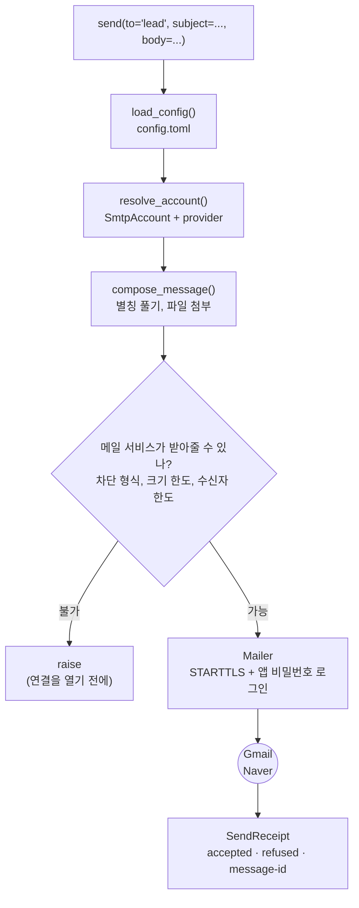

# mailmail

[](https://github.com/seokhoonj/mailmail/actions/workflows/check.yml)
[](https://pypi.org/project/mailmail/)
[](https://pypi.org/project/mailmail/)
[](https://github.com/seokhoonj/mailmail/blob/main/LICENSE)

[English](README.md) | **한국어**

NAVER·Gmail 계정으로 메일을 전송하는 파이썬 패키지. 첨부파일, HTML 본문, 참조(cc)를
지원하며, 자주 보내는 상대는 이름으로 저장해 두고 불러올 수 있습니다.

---

- [빠른 시작](#빠른-시작)
- [동작 개요](#동작-개요)
- [사전 준비](#사전-준비)
- [1. 설치](#1-설치)
- [2. 계정 설정](#2-계정-설정) (`~/.config/mailmail/config.toml`)
- [3. 앱 비밀번호 발급](#3-앱-비밀번호-발급) — NAVER, Gmail
- [4. 메일 전송](#4-메일-전송)
- [5. 다건 전송 (메일 머지)](#5-다건-전송-메일-머지) (`send_bulk`)
- [6. 명령줄에서 사용](#6-명령줄에서-사용) (`mailmail`)
- [7. 전송할 수 없는 파일](#7-전송할-수-없는-파일)
- [8. AI 코딩 에이전트에서 사용](#8-ai-코딩-에이전트에서-사용)
- [9. 문제 해결](#9-문제-해결)
- [10. 개발](#10-개발)

## 빠른 시작

```python
from mailmail import send

send(
    to          = "someone@example.com",
    subject     = "주간 보고",
    body        = "첨부 확인 부탁드립니다.",
    attachments = ["report.xlsx"],
)
```

Claude Code를 사용하면 파이썬 없이 자연어로 전송할 수 있습니다 → [AI 코딩 에이전트에서 사용](#8-ai-코딩-에이전트에서-사용)

Windows·macOS·Linux에서 동작합니다. 설치 시 credbox(자격증명 저장)와 tomlite(설정 편집)
두 개의 작은 자체 제작 라이브러리를 함께 내려받으며, 그 외 다른 의존성은 없습니다. 두
라이브러리 역시 그 자체로 의존성이 없습니다.

## 동작 개요

`send()`를 한 번 호출하면 설정을 읽고, 계정을 고르고, 별칭을 실제 주소로 풀어 메시지를
구성합니다. 메일 서비스가 반송할 요청(차단된 파일 형식, 크기 한도를 넘는 메일, 100명을 넘는
수신자)은 연결을 열기 전에 미리 걸러내고, 결과를 `SendReceipt`로 반환합니다.



## 사전 준비

- **Python 3.11 이상.** 터미널에서 `python --version`으로 확인합니다. (Windows에서는 `py
  --version`일 수 있습니다.) 없거나 낮으면 [python.org](https://www.python.org/downloads/)에서
  받습니다.
- **NAVER 또는 Gmail 계정.** Gmail은 누구나 만들 수 있습니다. NAVER는 한국 휴대폰 번호가
  있으면 가장 간단합니다. 외국인은 외국인등록증(ARC)으로 번호를 개통할 수 있습니다. 한국 번호가
  없으면 여권·정부 발급 신분증 인증으로도 가입할 수 있으며, 이 경우 하루이틀 소요됩니다. 요건은
  자주 바뀌고 국가마다 다르므로 NAVER 가입 페이지에서 확인합니다. NAVER 계정이 없어도 Gmail만으로
  충분합니다.
- **해당 계정의 앱 비밀번호.** 3단계에서 발급받습니다. **평소 로그인에 사용하는 비밀번호로는
  동작하지 않습니다.** 두 서비스 모두 이를 거부합니다.

## 1. 설치

```sh
pip install mailmail
```

설치 확인:

```sh
python -c "import mailmail; print(mailmail.__version__)"
```

## 2. 계정 설정

홈 폴더 아래 `.config/mailmail/`에 `config.toml` 파일을 만듭니다. 전체 경로는 다음과 같습니다.

| | 경로 |
|---|---|
| macOS · Linux | `~/.config/mailmail/config.toml` |
| Windows | `C:\Users\<사용자이름>\.config\mailmail\config.toml` |

직접 작성하지 않아도 됩니다. `mailmail set-password you@naver.com --alias personal`(3단계)이
파일을 만들고 계정을 추가하며, `mailmail add-contact` / `add-group`이 주소록을 채웁니다.
직접 작성하는 경우 형식은 다음과 같습니다.

```toml
default_account = "personal"

[[accounts]]
email = "you@naver.com"
alias = "personal"

[[accounts]]
email = "you@gmail.com"
alias = "work"

[contacts]
manager = "manager@example.com"
lead    = "lead@example.com"
friend  = "friend@example.com"
team    = ["manager", "lead"]
```

- `default_account` — 계정을 지정하지 않았을 때 사용할 기본 계정. 핸들(계정의 `alias`, 없으면
  `email`)을 가리킵니다.
- `[[accounts]]` — 사용할 계정 목록으로, 계정 하나에 테이블 하나입니다. 계정이 하나여도 됩니다.
  `email`은 필수이고, `alias`는 사서함을 가리키는 선택 핸들(`personal`, `work`)입니다. 메일
  서비스는 도메인(`@naver.com`, `@gmail.com`)으로 자동 판별하므로 따로 적지 않습니다.
- `[contacts]` — 주소록. 생략할 수 있습니다. 여러 명을 묶으면(`team`) 한 번에 전송할 수 있고,
  묶음 안에 다른 이름을 포함할 수도 있습니다.

**비밀번호는 이 파일에 넣지 않습니다.** 3단계에서 별도로 저장합니다.

## 3. 앱 비밀번호 발급

**이 단계에서 가장 많이 막힙니다.** 평소 로그인 비밀번호는 두 서비스 모두 거부하므로, 앱
비밀번호를 별도로 발급받아야 합니다. 두 서비스의 형식이 정반대여서 혼동하기 쉽습니다.

| | 자릿수 | 형태 | 2단계 인증 |
|---|---|---|---|
| **NAVER** | **12자리** | **대문자 + 숫자** | 필수 |
| **Gmail** | **16자리** | **소문자** | 필수 |

### NAVER

2025년 6월 24일부터 메일 프로그램 연결에 2단계 인증과 앱 비밀번호가 **필수**가 되었습니다.
이전에 정상 동작하던 설정이 갑자기 실패한다면 이 정책 변경 때문입니다.

1. **네이버ID → 보안설정 → 2단계 인증**을 켭니다. 이 항목을 켜지 않으면 다음 단계 메뉴가 나타나지 않습니다.
2. 같은 화면에서 **애플리케이션 비밀번호 → 생성하기**.
   - **종류 선택은 단순한 이름표입니다.** 아웃룩·아이폰·지메일 중 무엇을 선택하든 발급되는 비밀번호는 동일합니다.
     직접 입력란에 mailmail이라고 적어 두면 이후 식별하기 편리합니다.
   - 12자리 대문자+숫자가 표시됩니다. **이 화면을 벗어나면 다시 확인할 수 없으므로** 반드시 복사해 둡니다.
3. **메일 → 환경설정 → POP3/IMAP 설정**에서 **SMTP 사용함**으로 설정돼 있는지 확인합니다. 이미
   켜져 있더라도 **사용 안 함 → 저장 → 사용함 → 저장** 순서로 한 번 껐다 켭니다. 이때 2025년
   6월 정책 변경이 반영됩니다.

### Gmail

1. **2단계 인증을 먼저 켭니다.** 켜지 않으면 앱 비밀번호 메뉴가 나타나지 않습니다.
2. [myaccount.google.com/apppasswords](https://myaccount.google.com/apppasswords) 에서
   발급합니다.
3. 16자리 소문자가 네 칸씩 띄어 표시됩니다. 공백은 포함하든 제거하든 무관합니다.

### 발급받은 비밀번호 저장

**명령 하나로 계정을 기록하고 비밀번호를 저장하며**, 이후 다시 묻지 않습니다. 2단계를
건너뛰었다면 `config.toml`을 대신 생성하고, 도메인으로 메일 서비스를 판별한 뒤 비밀번호를
입력받습니다. 방금 발급한 비밀번호를 붙여넣으면 됩니다.

```sh
mailmail set-password you@naver.com --alias personal   # Gmail이면 you@gmail.com --alias work
```

붙여넣어도 **화면에 아무것도 표시되지 않는 것이 정상입니다.** `sudo`와 마찬가지로 입력이
가려집니다. 저장되면 `stored the app password for personal`이 출력됩니다. NAVER 비밀번호는
12자리, Gmail은 16자리입니다. 입력이 화면에 표시되지 않아 두 번 붙여넣어도 알아채기 어려운데,
이후 로그인이 거부되면 대개 이것이 원인이므로 명령을 다시 실행합니다.

비밀번호는 설정 파일이 아니라 같은 폴더의 `credentials.json`에 **본인만 읽을 수 있는 권한으로**
저장됩니다. 이 파일은 암호화되지 않습니다. 따라서 이곳에는 **앱 비밀번호만 저장합니다.** 앱
비밀번호는 메일 전송에만 사용되고, 계정 비밀번호는 그대로 둔 채 언제든 취소할 수 있기
때문입니다. 계정 비밀번호는 절대 넣지 않습니다.

### 로그인 확인

메일을 실제로 전송하지 않고 로그인만 확인할 수 있습니다.

```sh
python -c "
import smtplib
from mailmail import load_config, resolve_password

for name in ('personal',):  # Gmail도 저장했으면 ('personal', 'work')
    account = load_config().resolve_account(name)
    smtp = smtplib.SMTP(account.provider.smtp_host, account.provider.smtp_port, timeout=20)
    smtp.ehlo(); smtp.starttls(); smtp.ehlo()
    try:
        smtp.login(account.email, resolve_password(account))
        print(f'  {name}: OK')
    except smtplib.SMTPAuthenticationError as e:
        print(f'  {name}: {e.smtp_code} {e.smtp_error.decode()[:60]}')
    smtp.quit()
"
```

`OK`가 출력되면 설정이 완료된 것입니다. 그렇지 않으면 아래를 확인합니다.

| 오류 메시지 | 원인과 조치 |
|---|---|
| `535 5.7.1 Username and Password not accepted` (NAVER) | 비밀번호가 틀렸거나 SMTP가 꺼져 있습니다. 이 메시지로는 둘을 구분할 수 없으므로 **양쪽 모두 확인합니다.** |
| `534 5.7.9 Application-specific password required` (Gmail) | 로그인 비밀번호를 입력했습니다. 앱 비밀번호로 다시 시도합니다. |

## 4. 메일 전송

```python
from mailmail import send

send(
    to      = "someone@example.com",
    subject = "주간 보고",
    body    = "첨부 확인 부탁드립니다.",
)
```

주소록에 등록한 이름은 그대로 호출할 수 있으며, 실제 주소와 섞어 쓸 수 있습니다.

```python
send(to="lead", subject="주간 보고", body="확인 부탁드립니다.")
send(to=["lead", "someone@example.com"], subject="주간 보고", body="...")
send(to="team", subject="주간 보고", body="...")  # 묶음은 자동으로 펼쳐집니다
```

본문은 입력한 그대로 전송되므로 줄바꿈도 그대로 유지됩니다. 본문이 길 경우 삼중 따옴표(`"""`)를
사용하면 편리합니다.

```python
body = """\
안녕하세요,

주간 보고 첨부합니다. 손해율이 전월 대비 1.2%p 움직였고,
자세한 내용은 둘째 시트에 있습니다.

감사합니다.
"""

send(to="lead", subject="주간 보고", body=body, attachments=["report.xlsx"])
```

계정 지정, 첨부, 참조, HTML을 모두 사용하는 예시는 다음과 같습니다.

```python
receipt = send(
    account     = "work",  # 안 적으면 default_account
    to          = "lead",
    cc          = "team",
    bcc         = "audit@example.com",
    subject     = "월 마감",
    body        = "월 마감 수치 보냅니다.",
    html        = "<p>월 마감 수치 보냅니다.</p>",
    attachments = ["close.xlsx", "notes.pdf"],
)

if not receipt.is_complete:  # 일부 주소가 거부됐을 때
    print(receipt.reason_by_refused_recipient)
```

유의 사항:

- **`cc`를 지정하지 않으면 참조는 비어 있습니다.** 지정하지 않은 항목은 포함되지 않습니다.
- **`bcc`는 다른 수신자에게 표시되지 않습니다.** 숨은 참조끼리도 서로를 알 수 없습니다.
- **`html`과 `body`는 같은 내용이어야 합니다.** 메일 앱에 따라 둘 중 하나만 표시되므로, 다르게
  작성하면 수신자마다 다른 메일을 보게 됩니다.
- **한글은 그대로 사용합니다.** 제목과 본문 모두 별도 처리가 필요 없습니다.

## 5. 다건 전송 (메일 머지)

같은 안내를 수신자마다 다른 값·다른 첨부로 전송할 때는 `send_bulk`을 사용합니다. 수신자 한
명당 `Mail` 하나씩 담으면 모두 **하나의 연결로** 전송됩니다. 서른 명이라도 로그인은 서른 번이
아니라 한 번뿐입니다.

```python
from mailmail import Mail, send_bulk

receipts = send_bulk([
    Mail(to="cheolsu@example.com", subject="6월 실적",
         body="철수님, 첨부 확인 부탁드립니다.", attachments=["cheolsu.xlsx"]),
    Mail(to="younghee@example.com", subject="6월 실적",
         body="영희님, 첨부 확인 부탁드립니다.", attachments=["younghee.xlsx"]),
])

for receipt in receipts:
    if not receipt.is_complete:  # 이 건에서 거부된 주소가 있으면
        print(receipt.reason_by_refused_recipient)
```

`Mail`은 `send`과 동일한 필드를 사용합니다. `to`·`cc`·`bcc`에는 주소나 주소록 이름을 섞어
쓰고, `attachments`에는 파일 경로를 지정합니다. 각 건의 `Mail`을 다르게 구성하면 이름·수치·첨부를
건별로 개인화할 수 있습니다.

유의 사항:

- **결과는 입력한 순서 그대로 목록으로 반환됩니다.** `zip(mails, receipts)`로 각 건의 처리
  결과를 짝지을 수 있습니다. 한 건이 수신자 전원에게 거부되어도 그 건은 `accepted`가 빈
  receipt로 남고 **나머지는 정상 전송됩니다.** 30건 중 3건이 막혀도 나머지 27건은 전송됩니다.
- **잘못된 건은 대부분 전송 전에 걸러냅니다.** 어느 건이든 주소록에 없는 이름, 빈 제목, 차단된
  첨부, 이미 한도를 넘는 첨부가 있으면 **연결을 열기 전에** 예외가 발생하고 한 건도 전송되지
  않습니다.
- **취소할 수 없는 두 경우가 있습니다.** (1) 메시지를 조립한 뒤에야 크기 한도를 넘는
  경우(사전 검사는 첨부 용량만 재고 완성된 MIME 크기는 측정하지 못합니다), (2) 전송 도중 연결이
  끊기는 경우(네트워크 장애)입니다. 두 경우 모두 앞선 건은 이미 전송된 뒤라 취소할 수 없고,
  그때까지 수집한 receipt도 함께 잃습니다. 서버가 **수신자별로** 거부한 것은 예외가 아니라
  receipt에 담겨 반환됩니다.

## 6. 명령줄에서 사용

위의 모든 기능은 파이썬 없이 터미널에서도 사용할 수 있습니다. 패키지를 설치하면 `mailmail`
명령이 `PATH`에 등록됩니다.

```sh
mailmail send --to lead --subject "주간 보고" --body "검토 부탁드립니다."
```

`--to`(및 `--cc`, `--bcc`)는 주소나 주소록 이름을 받으며, 여러 개일 때는 반복해서 지정합니다.
`--attach`도 반복할 수 있습니다. 줄바꿈이 있는 본문은 셸 인자 하나로 넘기기보다 파일이나
파이프로 전달하는 편이 좋습니다.

```sh
mailmail send --to team --subject "월말 결산" \
    --body-file note.txt --attach close.xlsx --attach notes.pdf --account work

mailmail send --to lead --subject "주간 보고" < note.txt
```

CSV로 다건을 전송할 수도 있습니다. 한 행이 한 건이고, 배치 전체가 로그인 한 번으로 처리됩니다.
헤더가 필드 이름이며 `to`·`subject`·`body`는 필수, `cc`·`bcc`·`html`·`attachments`는 선택입니다.
한 셀에 여러 값이 들어가는 칸(수신자, 첨부)은 세미콜론으로 구분합니다.

```sh
mailmail send-bulk batch.csv --account work
```

```csv
to,subject,body,attachments
cheolsu@example.com,6월 실적,"철수님, 첨부 확인 부탁드립니다.",cheolsu.xlsx
team,6월 요약,"수치 전부 첨부했습니다.",june.xlsx;notes.pdf
```

나머지 명령은 설정과 확인에 사용합니다.

```sh
mailmail setup                                        # 설정·자격증명 파일 경로와 템플릿 출력
mailmail contacts                                     # 사용 가능한 계정과 주소록 이름 확인
mailmail set-password you@naver.com --alias personal  # 설정 작성 + 앱 비밀번호 저장
mailmail add-contact lead lead@example.com            # 주소록 별칭 추가
mailmail add-group   team manager lead                # 주소·별칭 묶음(그룹) 생성
mailmail import-contacts contacts.csv                 # name,email CSV로 다건 추가
```

`set-password`는 비밀번호를 인자로 받지 않고 프롬프트로 입력받으므로 셸 히스토리에 남지
않습니다. `add-contact`·`add-group`은 `config.toml`을 제자리에서 편집해 주석과 서식을 그대로
보존합니다. `import-contacts`는 `name`·`email` 열이 있는 CSV를 읽어 모든 행을 한 번에
추가합니다. 주소가 잘못된 행이 있으면 해당 행을 지정해 알리고 아무것도 저장하지 않으므로, 오타
하나로 주소록이 절반만 채워지는 상황을 방지합니다.

`send`·`send-bulk`도 차단된 첨부, 한도를 넘는 메일, 저장되지 않은 비밀번호처럼 메일 서비스가
거부할 요청을 파이썬에서와 동일하게 연결을 열기 전에 알립니다. 일부 수신자만 거부되면 종료
코드가 0이 아니므로 스크립트가 이를 감지할 수 있습니다.

`setup`을 제외한 모든 명령은 `--config PATH`로 기본 위치(`mailmail setup`이 출력하는 경로)
대신 다른 설정 파일을 지정할 수 있습니다.

## 7. 전송할 수 없는 파일

메일 서비스가 거부할 첨부는 **전송 전에** 예외로 알립니다. 서버까지 전송한 뒤 몇 분 후 반송
메일로 확인하는 것보다 낫기 때문입니다.

- **실행 파일.** `.exe`, `.dll`, `.jar`, `.js`, `.bat`, `.vbs`, `.ps1`, `.msi` 등입니다.
  `.zip`이나 `.tar.gz` **안에 넣어도 동일하게 차단됩니다.** ([Gmail이 공개한 목록](https://support.google.com/mail/answer/6590).
  NAVER는 목록을 공개하지 않으므로 같은 기준을 적용합니다.)
- **비밀번호가 걸린 zip.** 내용물과 관계없이 거부됩니다. 메일 서비스가 내부를 열어 볼 수 없기 때문입니다.
- **지나치게 크거나 여러 겹으로 압축된 파일.** 압축은 4겹까지, 내부 파일은 64MB까지만 검사합니다.

반드시 전송해야 하는 경우 링크로 공유합니다.

**크기 한도** — 첨부는 메일에 실리면서 약 37% 커집니다. 따라서 원본 파일 용량 합계 기준으로
**Gmail 약 25MB**, **NAVER 약 27MB**가 상한입니다. 웹 화면이 안내하는 숫자와 다를 수 있으나,
실제로 통과되는 기준은 이 값입니다.

**`.7z`과 `.rar`은 내부를 검사할 수 없습니다.** 파이썬 표준 라이브러리가 이 형식을 읽지 못하기
때문입니다. 이 안에 실행 파일이 포함돼 있으면 검사를 통과해 서버까지 갔다가 거부됩니다. 두
형식은 사용하지 않는 것을 권장합니다.

## 8. AI 코딩 에이전트에서 사용

[Claude Code](https://claude.com/claude-code)나 Codex에 스킬을 설치하면 파이썬 없이 **자연어로**
메일을 전송할 수 있습니다. 스킬은 Claude에게 "이런 요청이 오면 이렇게 처리하라"를 지시하는 설명서입니다.

### 8.1 Claude Code

Claude Code 채팅창에서 마켓플레이스를 추가하고 설치합니다.

```
/plugin marketplace add seokhoonj/mailmail
/plugin install mailmail@mailmail
```

이후 `/mailmail:send`(또는 자연어)로 호출합니다. 스킬이 `mailmail` 명령을 실행하므로 패키지도
설치돼 있어야 합니다(1단계). 자세한 내용은 `plugins/mailmail/skills/send/SKILL.md`를 참고합니다.

### 8.2 Codex

터미널에서 마켓플레이스를 추가하고 설치합니다.

```
codex plugin marketplace add seokhoonj/mailmail
codex plugin add mailmail@mailmail
```

`send` 스킬이 관련 요청에 자동으로 반응합니다.

### 8.3 플러그인 없이 (symlink)

저장소를 내려받아 스킬 폴더를 에이전트가 참조하는 위치에 심링크합니다.

```sh
git clone https://github.com/seokhoonj/mailmail.git
ln -s "$PWD/mailmail/plugins/mailmail/skills/send" ~/.claude/skills/send   # Claude Code → /send
ln -s "$PWD/mailmail/plugins/mailmail/skills/send" ~/.codex/skills/send    # Codex → $mailmail:send
```

Claude Code는 즉시 인식하고, Codex는 재시작해야 스킬을 불러옵니다.

```powershell
git clone https://github.com/seokhoonj/mailmail.git
New-Item -ItemType SymbolicLink -Path "$HOME\.claude\skills\send" `
         -Target "$PWD\mailmail\plugins\mailmail\skills\send"  # Windows (PowerShell)
```

이후에는 Claude Code에서 자연어로 요청하면 됩니다.

> 6월 손익 요약해서 표로 만들고, balance.xlsx 첨부해서 lead 한테 보내줘.

**무엇을 본문에, 무엇을 첨부로, 누구에게** 보낼지 지정하면 그대로 조립합니다. 지정하지 않은
항목은 되묻고, 임의로 추측하지 않습니다.

전송 전에 **받는 사람·제목·첨부를 펼쳐 보여 주고 승인을 받습니다.** 주소록 이름은 실제 주소로
풀어서 표시하므로, `team`이 정확히 누구에게 전송되는지 확인할 수 있습니다. 메일은 취소할 수 없기
때문입니다.

## 9. 문제 해결

예외 메시지가 무엇이 잘못됐고 어떻게 해결하는지 문장으로 알립니다.

| 예외 | 원인과 조치 |
|---|---|
| `ConfigError` | 설정 파일이 없거나 형식이 잘못됐습니다. 2단계(계정 설정) 참고 |
| `MissingPasswordError` | 비밀번호가 아직 저장되지 않았습니다. 3단계(앱 비밀번호 발급) 참고 |
| `UnknownContactError` | 주소록에 없는 이름입니다. 등록된 이름 목록을 함께 알립니다 |
| `BlockedAttachmentError` | 메일 서비스가 차단하는 파일입니다. 링크로 공유합니다 |
| `MessageTooLargeError` | 첨부가 한도를 넘습니다 |
| `TooManyRecipientsError` | 한 건의 수신자가 100명을 넘습니다. 여러 번으로 나눠 전송합니다 |
| `AuthenticationFailedError` | 로그인이 거부됐습니다. 앱 비밀번호가 정확한지, NAVER라면 SMTP가 켜져 있는지 확인합니다 |

## 10. 개발

```sh
git clone https://github.com/seokhoonj/mailmail.git
cd mailmail
python -m venv .venv
source .venv/bin/activate  # Windows는 .venv\Scripts\activate
pip install -e ".[dev]"
pytest                     # 실제로 메일을 전송하지 않고 가짜 SMTP 서버를 사용합니다
ruff check src tests scripts
mypy
```
